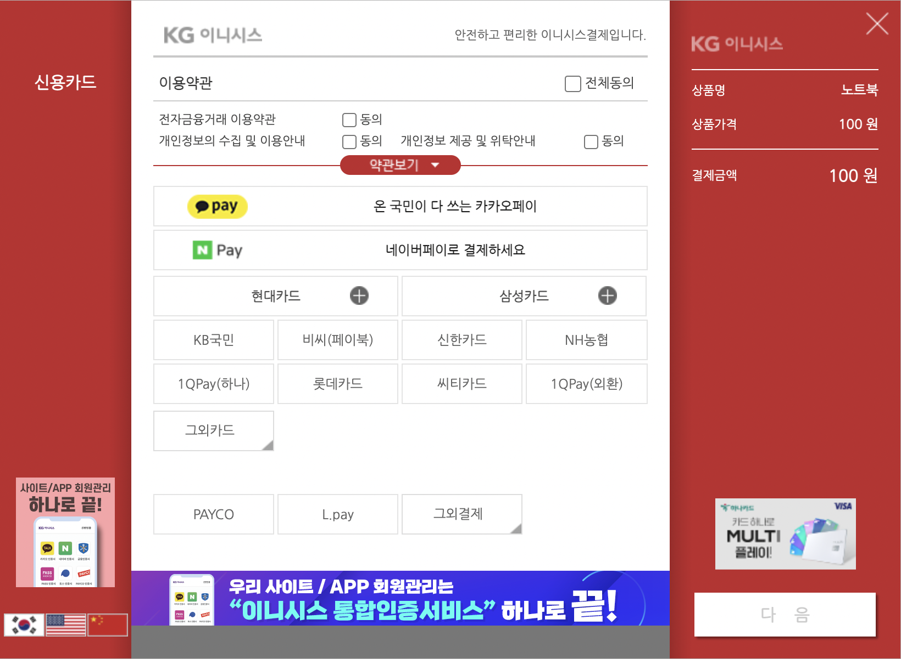
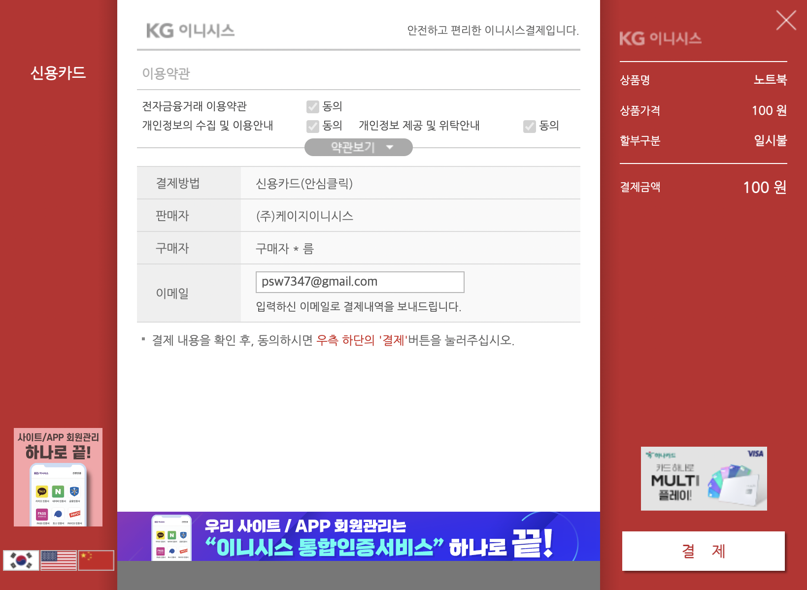

# IAMPORT-REACT-TS
아임포트([iamport.kr](https://www.iamport.kr/))의 JavaScript SDK를 이용해 React와 TypeScript로 구현한 예제입니다.

<br/>

# 버전
- JavaScript SDK
  ```html
  <!-- jQuery -->
  <script type="text/javascript" src="https://code.jquery.com/jquery-1.12.4.min.js"></script>
  <!-- iamport.payment.js -->
  <script type="text/javascript" src="https://cdn.iamport.kr/js/iamport.payment-1.1.8.js"></script>
  ```
- node ≥ v16

<br/>   

# 실행
```bash
$ git clone https://github.com/SeiwonPark/iamport-react-ts.git
$ cd iamport-react-ts
$ nvm install
$ cd app
$ npm ci && npm start
```

<br/>

# 실행 결과

- 결제 창
  
  
- 콘솔   
  ```bash
  {
    apply_num: "*********************"
    bank_name: null
    buyer_addr: "서울특별시 강남구 삼성동"
    buyer_email: "psw7347@gmail.com"
    buyer_name: "구매자 이름"
    buyer_postcode: "123-456"
    buyer_tel: "010-1234-5678"
    card_name: "국민KB카드"
    card_number: "*********************"
    card_quota: 0
    currency: "KRW"
    custom_data: null
    imp_uid: "*********************"
    merchant_uid: "merchant_1648282503918"
    name: "노트북"
    paid_amount: 100
    paid_at: 1234567890
    pay_method: "card"
    pg_provider: "html5_inicis"
    pg_tid: "StdpayCARDINIpayTest*********************"
    pg_type: "payment"
    receipt_url: "https://iniweb.inicis.com/DefaultWebApp/mall/cr/cm/mCmReceipt_head.jsp?noTid=StdpayCARDINIpayTest*********************&noMethod=1"
    status: "paid"
    success: true
  }
  ```